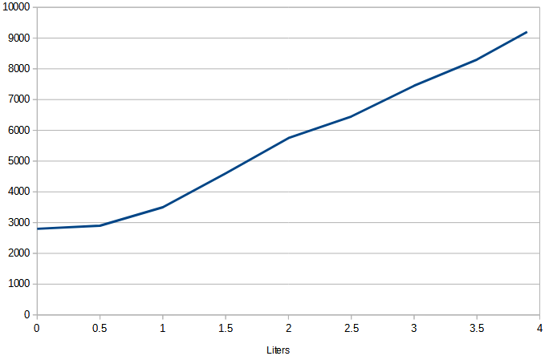
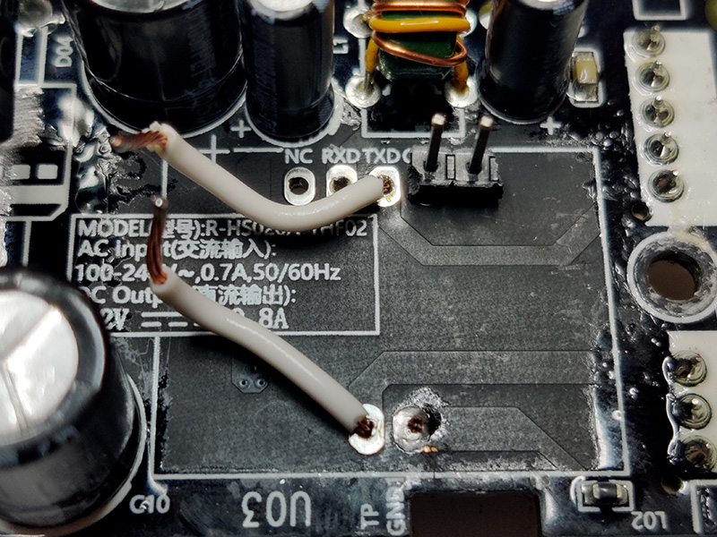
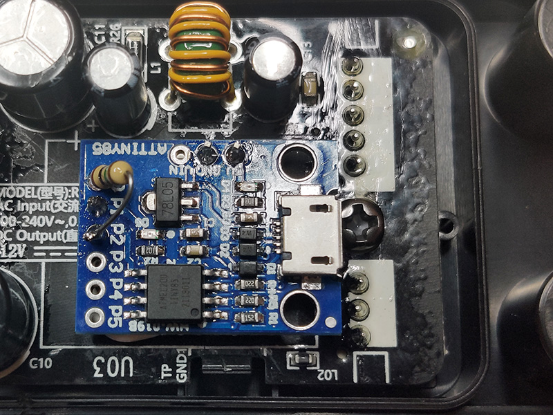
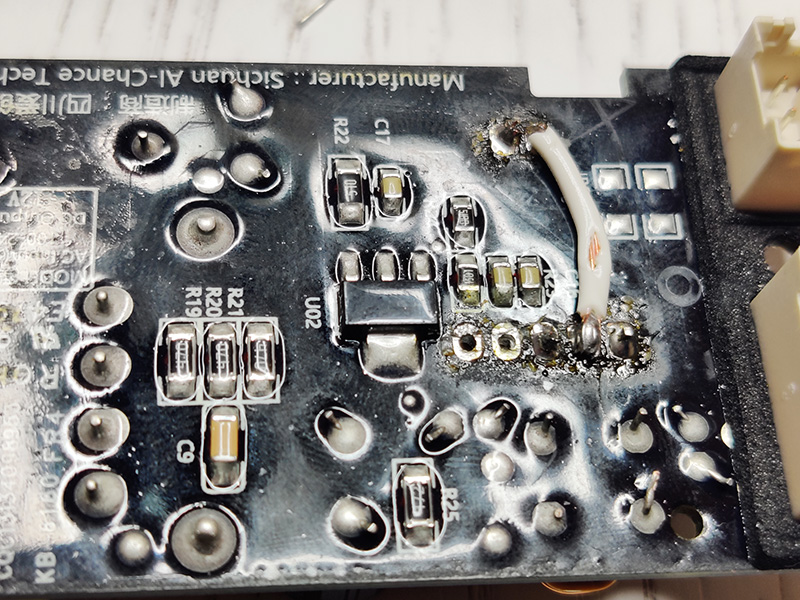

# xiaomi-humidifier-water-sensor-digispark
Xiaomi SmartMi Evaporative Humidifier water level sensor for digispark ATTiny85

## Description
This project is modified from the original to work with a digispark clone.

### Benefits
- Based on cheap clone
- Fits fully inside the case
- Calibration by shorting P3 to GND
- In-circuit programmable

### Parts list
- Digispark clone, get the blue board with the microUSB socket from e.g. <a href="https://www.aliexpress.com/wholesale?SearchText=attiny85+blue">AliExpress</a>.
- USB to microUSB cable for loading the software
- 1M resistor
- Wire

### Notes
P1 is used for serial because it has a LED on it. So you can see if it is sending serial packets, and also it does not interfer with capacitance measurement.

Sensor response is not very linear below 0.5L, but because below 0.5L the drum can't really reach the water anyway, it does not make sense to linearize it:  

### Compiling
You need the CapacitiveSensor libary - just install it in Arduino IDE.  
Also grab and install the SendOnlySoftwareSerial library here: https://github.com/nickgammon/SendOnlySoftwareSerial

## Step by step guide
1. Disassemble the humidifer and remove the power board (located in the back where AC cord goes in)
2. Desolder the blue rectangular component on the power board, marked U03. Good idea to clear some of the lacquer off, and after that desoldering wick and some wiggling of the pins should do it.
3. Cut off 2 pins of the header that came with your digispark and solder them to GND and 5V pads.
4. Connect wires to the TP and TXD pads.  

5. Program the digispark with the sketch.
6. Solder one end of 1M resistor to P0 and clip the lead.
7. Fit and solder in the digispark.
- Angle the ATTiny85 a little towards the top of the PCB, so microUSB plug clears screw extrusion when connected.
- Leave longer leads on the through-hole wires on the digispark. On P1 to be able to attach the USB-TTL and on P2 to solder the resistor to the wire.  

8. Connect the sensor and the main ground on the back of the PCB, because the ATTiny85 obviously does not have a separate analog ground.  

9. Calibration:
- The humidifer should be completely dry, the sensor clean and dry, and the bottom part should be fully assembled (incl. the drum). Do not try to calibrate outside of the circuit or with partial lower part, it will not yield a good result.
- Connect P3 to GND on the digispark board with a temporary jumper.
- Plug in the humidifer and immediately press the power button, so it turns on.
- If the calibration process started successfully, the humidifer will display 5 bars without flashing for 10 seconds. After 10 seconds it will display 1 bar. If the humidifer displays 3 bars, you have a short in the sensor or the sensor wiring. Fix it and try again.
- After humidifer displays 1 bar, start to fill the humidifer with water. The sensor will use default values to show you the level. Fill the water until 5 bars begin flashing.
- The calibration is complete and stored in the EEPROM, and will be used on startup.
- Remove the jumper between P3 and GND and reassemble the humidifier.
