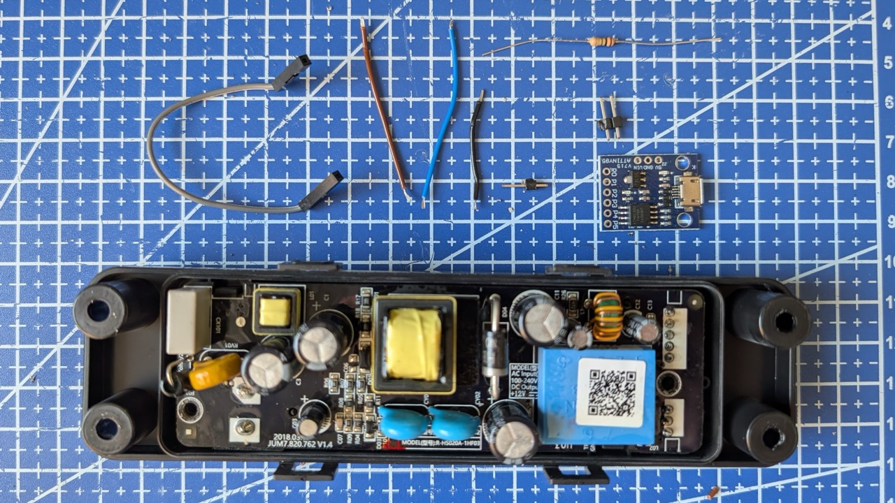
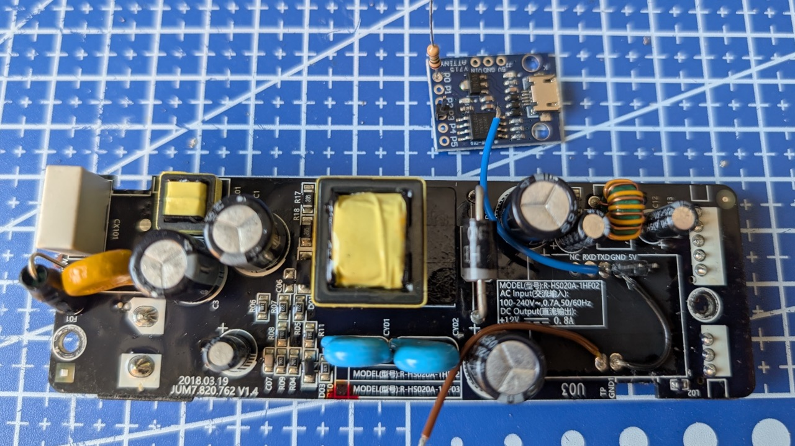
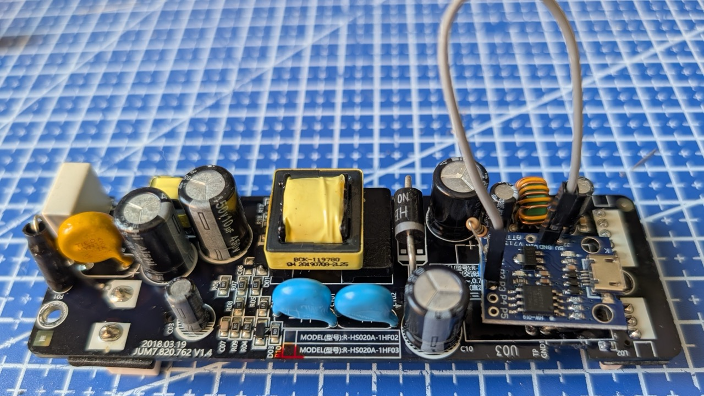

# xiaomi-humidifier-water-sensor-digispark


Fixing the Xiaomi SmartMi Evaporative Humidifier (v1 and v2) water level. 
If your humidifier always shows 100% or 0%, the microcontroller measuring the water level is busted (happens very often).

This is a guide on how to (rather easily) replace that component with a bit of software, a digispark ATTiny85 clone, and some soldering.


### Parts list
- Digispark clone, get the blue board with the microUSB socket from e.g. <a href="https://www.aliexpress.com/wholesale?SearchText=attiny85+blue">AliExpress</a>.
- USB to microUSB cable for loading the software
- Jump cable
- 3 pieces of lose wire.
- Solder iron (ideally also desolderer)
- 1M resistor

### Notes
P1 is used for serial because it has a LED on it. So you can see if it is sending serial packets, and also it does not interfer with capacitance measurement.


### Compiling
All you need is PlatformIO (in VsCode or command line).

```bash
brew install platformio
```

```bash
platformio run #build
pio run -t upload # upload
```


## Step by step guide


1. Disassemble the humidifer and remove the power board (located in the back where AC cord goes in). Follow [guide until 3:59](https://youtu.be/1uuoOY5wYA0?si=DuIZzP7-71Kr1syy&t=239) while skipping the touchpad part.



2. Desolder the blue rectangular component on the power board, marked U03. Good idea to clear some of the lacquer off, and after that desoldering wick and some wiggling of the pins should do it.

3. Solder on the power board:

   - Solder cables onto `TP` and `TXD` pads.
   - Solder 2 header pins onto `GND` and `5V` *at the same time* solder cable on the same `GND`. 
   - Solder the other end of the cable to `GND1`.

4. Solder on the digispark:
   - Add a 1 header pin onto `P3` for easy calibration.
   - Solder one end of the `1M` resistor to `P0`, cip the end.



5. Solder digispark to power board:
   - Put the other leg of the `1M` resistor through `P2`.
   - Put the `TP` cable to `P2` alongside the leg of the resistor. Solder and clip the reminder of the leg.
   - Solder `TXD` cable onto `P1`
   - Put down the board through the 2 header pins (`GND` and `5V` on the digispark) and solder them as low as possible leaving some of the header free.

6. Put a jumper cable between `P3` and `GND` header pins on the digispark. Verify with a multimeter that all things are connected and nothing shorts.




## Calibration

Do this while you have the `P3` and `GND` shorted in step 6.

 - Put back everything except for the top part cover. 
 - The humidifer should be empty, the sensor clean (decalcified), and the bottom part should be fully assembled (incl. the drum). Do **not try** to calibrate outside of the circuit or with partial lower part, it will not yield a good result.
 - Fill the water until it is just below the "holes" of the sensor.This will be your "minimum level". Put the top part back on.

 - Plug in the humidifer and immediately press the power button (right), so it turns on. If you have dimmed the LEDs before, press the left button.
 - You should see (if everything is successful):
   * ✅✅✅✅✅ 5 bars no flashing for 10 seconds
   * ✅⏹️⏹️⏹️⏹️ 1 bar no flashing after 10 seconds.
   * **Error indicator** If you never see 5 bars and see constant ✅✅✅⏹️⏹️ 3 bars, this is an indicator of an error with your digispark. You may have shorted something or your board is incorrect. Fix and try again.

 - At 1 bar, start filling in the humidifier with water. The software's uncalibrated defaults should indicate filling, although inaccurately.

 - At some point before filling you should see ✳️✳️✳️✳️✳️ 5 bars flashing. Congrats, you're done with the calibration.
    * **Error indicator** If the level doesn't change at all during filling ( ✅⏹️⏹️⏹️⏹️), and only at the end shows ✳️✳️✳️✳️✳️ 5 flashing bars, you may have an issue with digispark board being shorted or the sensor wasn't clean.

 - Unplug the humidifier. 

Take out the jumper between `P3` and `GND` and put everythign back together.


# Credits

Based on great work (in chronolical order)
 * https://github.com/prj/xiaomi-humidifier-water-sensor-digispark
 * https://github.com/fakcior/xiaomi-humidifier-water-sensor
 * https://github.com/tomasvilda/humidifierstart